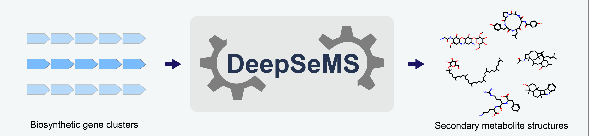

# DeepSeMS

**DeepSeMS** is a Transformer-based large language model designed to reveal the hidden biosynthetic potential of microbial genomes. It predicts chemical structures (SMILES) directly from biosynthetic gene clusters (BGCs) identified by antiSMASH or DeepBGC.

**Key Features**:
1. Predicts natural product structures directly from BGC sequences.
2. Supports BGC annotations generated by antiSMASH and DeepBGC as input sources.
3. Provides top-ranked SMILES, model confidence, and consensus scoring. 
4. User friendly web server and fully reproducible environment via Docker.

## Table of Contents
- [Publication](#publication)
- [Web Server](#web-server)
- [Installation & Setup](#installation--setup)
  - [Required Files & Project Setup](#required-files--project-setup)
    - [Clone the repository](#step-1-clone-the-repository)
    - [Download required support files](#step-2-download-required-support-files)
      - [Model checkpoints](#1-model-checkpoints)
      - [Pfam database](#2-pfam-database)
    - [Verify directory structure](#step-3-verify-directory-structure)
  - [Prepare input BGC files](#prepare-input-bgc-files)
  - [Run DeepSeMS with Docker (Recommended)](#run-deepsems-with-docker-recommended)
    - [Pull the DeepSeMS docker image](#step-1-pull-the-deepsems-docker-image)
    - [Start the container](#step-2-start-the-container)
    - [Run predictions](#step-3-run-predictions)
    - [Understanding the output](#step-4-understanding-the-output)
    - [Advanced usage](#advanced-usage)
      - [Calculate molecular properties](#calculate-molecular-properties)
      - [Batch running](#batch-running)
  - [Local Installation (Conda)](#local-installation-conda)
- [Model Training (Optional)](#model-training-optional)
  - [Training data](#1-training-data)
  - [Retraining](#2-retraining)
  - [Customized training](#3-customized-training)
  - [Training from scratch](#4-training-from-scratch)
- [Requirements](#requirements)
- [Preferred Hardware](#preferred-hardware)

## Publication
DeepSeMS: a large language model reveals hidden biosynthetic potential of the global ocean microbiome. *bioRxiv* 2025.03.02.641084; doi: https://doi.org/10.1101/2025.03.02.641084
## Web Server
DeepSeMS provides an online web server that allows users to run the model without installing any software:
[https://biochemai.cstspace.cn/deepsems/](https://biochemai.cstspace.cn/deepsems/)

## Installation & Setup
DeepSeMS can be run through Docker (recommended) or a local Conda environment.  
Before running DeepSeMS, please complete the Required Files & Project Setup section below.  
### Required Files & Project Setup
DeepSeMS requires several data files prior to running predictions:
#### Step 1: Clone the repository
```
git clone https://github.com/lab-of-biochemai/DeepSeMS.git
cd DeepSeMS
```
#### Step 2: Download required support files
All required support files are hosted on Figshare (http://doi.org/10.6084/m9.figshare.29680658) and must be downloaded before running predictions, as GitHub does not support large file storage. Download and place them accordingly:
##### 1. Model checkpoints:
Place the checkpoint files (`checkpoint0.ckpt` ... `checkpoint9.ckpt`) into the `./checkpoints/` directory.
##### 2. Pfam database:
Unzip pfam.zip and copy all Pfam files (e.g., Pfam-A.hmm, Pfam-A.hmm.h3f, etc.) into the ./data/pfam/ directory.  
Note: You may need to run `hmmpress ./data/pfam/Pfam-A.hmm` if index files are missing.
#### Step 3: Verify directory structure
Ensure your local directory is organized as follows before running the model:
```text
DeepSeMS/
├── checkpoints/       # Place model weights here (.ckpt)
├── data/
│   ├── pfam/          # Place Pfam database files here
│   ├── data_set.csv   # Data set for training from scratch
├── vocabs/            # Vocabulary files
├── test/              # Input files for prediction
│   ├── outputs/       # Annotation and output result files
├── tokenizer/
│   ├── tokenizer.py   # Tokenizer 
├── models/            # Model architecture code
├── calculate_molecular_properties.py   # Result post-processing
├── data_processing.py # Data processing for training from scratch
├── predict.py         # Prediction script
├── train.py           # Training script
├── environment.yml    # Code environment file
└── README.md
```
### Prepare input BGC files
DeepSeMS supports two input types (Examples are provided in the repository):
| Source Tool   | File Format    | Example                  |
| ------------- | -------------- | ------------------------------- |
| **antiSMASH** | `GENBANK`         | `./test/antiSMASH_example.gbk`    |
| **DeepBGC**   | `FASTA`         | `./test/DeepBGC_example.fa` |

⚠️ Raw genome FASTA cannot be used directly. You must first annotate BGCs using antiSMASH or DeepBGC.
### Run DeepSeMS with Docker (Recommended)
Docker provides the simplest and most reproducible way to run DeepSeMS.
#### Step 1: Pull the DeepSeMS docker image
```bash
docker pull tingjunxu2022/deepsems:v1
```
#### Step 2: Start the container
Mount your current directory (containing code and data) to `/deepsems` inside the container.
```Bash
# Assuming the DeepSeMS project directory is /home/user/deepsems.
docker run -it -v /home/user/DeepSeMS:/deepsems tingjunxu2022/deepsems:v1 /bin/bash
```
Or run the container with GPUs. ([NVIDIA Container Toolkit](https://docs.nvidia.com/datacenter/cloud-native/container-toolkit/latest/install-guide.html))
```Bash
docker run --gpus all -it -v /home/user/DeepSeMS:/deepsems tingjunxu2022/deepsems:v1 /bin/bash
```
#### Step 3: Run predictions
Inside the container, use `predict.py` to generate SMILES strings from BGC file.
```Bash
cd /deepsems
python predict.py
```
- Arguments:
  - `--input`: Path to the input file.
  - `--type`: Input format. Options: antismash (default) or deepbgc.
  - `--output`: Directory to save annotation and output result files (default: ./test/outputs/).
  - `--pfam`: Directory to pfam database files (default: ./data/pfam/).
##### Example 1: Predict from antiSMASH results (GenBank)
This is the default mode.
```Bash
python predict.py --input ./test/antiSMASH_example.gbk --type antismash
```
##### Example 2: Predict from DeepBGC results (FASTA)
```Bash
python predict.py --input ./test/DeepBGC_example.fa --type deepbgc
```
#### Step 4: Understanding the output
The output result will be directly printed and saved to an `.csv` file in output directory with the same name as the input file (e.g., `./test/outputs/antiSMASH_example/antiSMASH_example_result.csv`).  
Results are ranked by consensus across the top-10 models and predicted scores, with the top-ranked structure being the one most consistently predicted.
```Bash
Typical output:
------------------------------
Rank: 1 
Predicted SMILES: CC(C)C1C=CC(=O)NCCC=CC(NC(=O)C(NC(=O)O)C(C)C)C(=O)N1
Predicted score: 87.86
Consensus count: 5
------------------------------
Rank: 2
Predicted SMILES: CCCCCCC=CC=CC(=O)NC(C(=O)NC1CCCCNC(=O)C=CC(CC)NC1=O)C(C)O
Predicted score: 85.68
Consensus count: 3
------------------------------
Rank: 3
Predicted SMILES: CCCCCCCCC=CCC(=O)NC(C(=O)NC1CC(=O)C=CC(C(C)C)NC1=O)C(C)C
Predicted score: 83.41
Consensus count: 2
...
```
Explanation:

| Field         | Meaning                                                 |
| ------------- | ------------------------------------------------------- |
| **Predicted SMILES**  | The predicted valid chemical structure            |
| **Predicted score**   | Model confidence (higher = better)                      |
| **Consensus count**   | Consistency among 10 submodels (higher = more reliable) |

### Advanced usage
#### Calculate molecular properties
You must manually download SAScorer from RDKit's official GitHub repository (https://github.com/rdkit/rdkit/tree/master/Contrib/SA_Score), and place the package files (e.g., `sascorer.py, fpscores.pkl.gz`) into the `./sascorer` directory.  
Run `calculate_molecular_properties.py` to calculate molecular properties from a DeepSeMS result file:
```Bash
# For example:
python calculate_molecular_properties.py --input_file ./test/outputs/antiSMASH_example/antiSMASH_example_result.csv
```
- Arguments:
  - `--input_file`: Path to the DeepSeMS result file.
  - `--output_dir`: (Optional) Directory to save the output file. If not specified, the output file will be saved in the same directory as the input file.
#### Batch running
`predict.py` currently supports processing a single BGC per run.  
To efficiently run predictions on a large number of BGC files, you can use `GNU parallel` or a simple `Bash loop`.  
##### Install GNU parallel
```bash
# Ubuntu / Debian
sudo apt-get install parallel
# macOS
brew install parallel
# Conda (recommended, no sudo required)
conda install -c conda-forge parallel
```
Assume your input BGC files are stored in `./inputs/`. Run antiSMASH `.gbk` files in parallel.
```bash
parallel -j N     'python predict.py --input {} --type antismash'     ::: ./inputs/*.gbk
```
Run DeepBGC `.fa` files in parallel.
```bash
parallel -j N     'python predict.py --input {} --type deepbgc'     ::: ./inputs/*.fa
```
- Notes:
  - `-j N`: number of parallel jobs   
  - Outputs will be written to the default output directory (or specify via `--output`).
##### Alternative: Bash loop (if GNU parallel is not available)
```bash
for f in ./inputs/*.gbk; do
    python predict.py --input "$f" --type antismash
done
```
### Local Installation (Conda)
If you prefer to run it locally without Docker, we recommend using Conda.  
Create a Conda environment from environment.yml
```Bash
conda env create -f environment.yml
conda activate deepsems
```
Or configure a Conda environment step by step
```Bash
conda create -n deepsems python=3.10
conda activate deepsems
conda install -c bioconda hmmer=3.3.2
pip install torch==2.1.0 torchtext==0.16.0
pip install biopython==1.79 pandas==2.0.3 rdkit==2023.03.1 numpy==1.26.0
```
## Model Training (Optional)
### 1. Training data
You must download the training data (https://figshare.com/ndownloader/files/60134648) before running model training.   
Unzip and place the training data files (e.g., `tran_*.csv, val_*.csv`) into the `./data` directory.
### 2. Retraining
To retrain the model using the default hyperparameters (10-fold Cross-Validation), simply run the `train.py` script without arguments.   
⚠️ It will take 5-6 days on one NVIDIA-GeForce-RTX-4090 GPU:
```Bash
python train.py
```
This will train 10 separate models and save checkpoints (`checkpoint0.ckpt` ... `checkpoint9.ckpt`) to the `./checkpoints/` folder.
### 3. Customized training
You can customize the model architecture and training process.   
Below is the full list of arguments available you can pass to the `train.py` script for customization:

| Argument | Type | Default | Description |
| :--- | :--- | :--- | :--- |
| **Training Setup** | | | |
| `--batch_size` | `int` | `64` | Number of samples per batch. |
| `--epochs` | `int` | `500` | Total number of training epochs per fold. |
| `--lr` | `float` | `0.0001` | Learning rate for the AdamW optimizer. |
| `--patience` | `int` | `10` | Early stopping patience (epochs without improvement). |
| **Model Architecture** | | | |
| `--d_model` | `int` | `512` | Dimension of the embeddings and hidden layers. |
| `--n_heads` | `int` | `8` | Number of attention heads. |
| `--n_enc` | `int` | `6` | Number of encoder layers. |
| `--n_dec` | `int` | `6` | Number of decoder layers. |
| `--dropout` | `float` | `0.1` | Dropout probability. |
| **Misc** | | | |
| `--model_prefix` | `str` | `checkpoint` | Prefix for saved model files (e.g., `checkpoint0.ckpt`). |

### 4. Training from scratch
#### Step 1: Install additional dependency
```Bash
pip install scikit-learn==1.7.2
```
#### Step 2: Data processing
Run `data_processing.py` with default arguments as the pretrained model to process the data set for training from scratch. It will perform data augmentation, SMILES canonicalization, and data partitioning.
```Bash
python data_processing.py
```
- Arguments:
  - `--input`: Path to the data set file. (default: ./data/data_set.csv)
  - `--output`: Directory to save the output file. (default: ./data/)
  - `--type`: Data augmentation type. Options: 0 (structural features-aligned SMILES enumeration) or 1 (randomized SMILES enumeration). (default: 0)
  - `--enum_factor`: Data amplification factor. (default: 100)
  - `--max_tries`: Maximum trying number for SMILES enumeration. (default: 500)
#### Step 3: Run training from scratch
Run `train.py` script for training from scratch.
```Bash
python train.py
```
## Requirements
Annotated versions are tested, later versions should generally work.
- Language: `Python 3.10`
- Deep Learning: `PyTorch 2.1.0, TorchText 0.16.0`
- Bioinformatics: `HMMER3 (v3.3.2), Biopython (v1.79), Pfam Database (v36.0)`
- Chemistry: `RDKit (v2023.03.1)`
- Data Handling: `Pandas (v2.0.3), numpy (v1.26.0)`
## Preferred Hardware
- `CUDA 12.0` (tested)
- `GPU VRAM: 24 GB` (NVIDIA GeForce RTX 4090 tested)