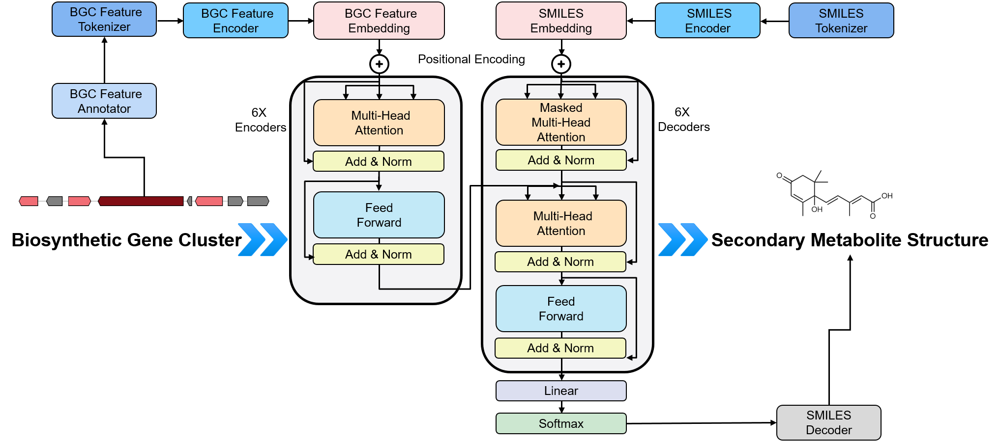
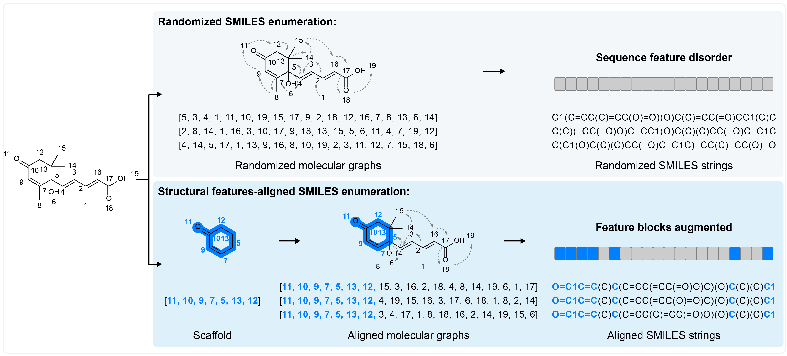

# DeepSeMS Model Construction

**DeepSeMS** is a transformer-based model designed to predict chemical structures from BGC sequences. Input BGC sequences are first represented by Pfam identifiers and tokenized before being embedded into the transformer neural network. Subsequently, a chemical sequence decoder was used to convert the output target sequences to predicted structures. For more details about DeepSeMS architecture, please see our paper published.


## Table of Contents
- [Data Preparation and Model Development](#data-preparation-and-model-development)
  - [Data Preparation](#data-preparation)
    - [Option 1: Using the processed training dataset](#option-1-using-the-processed-training-dataset)
    - [Option 2: Processing from raw data](#option-2-processing-from-raw-data)
      - [Step 1: Install additional dependency](#step-1-install-additional-dependency)
      - [Step 2: Prepare raw data](#step-2-prepare-raw-data)
      - [Step 3: Data processing and augmentation](#step-3-data-processing-and-augmentation)
  - [Model Development](#model-development)
    - [Option 1: Reproduce the published DeepSeMS model](#option-1-reproduce-the-published-deepsems-model)
    - [Option 2: Development customized model](#option-2-development-customized-model)
      - [Step 1: Model Architecture](#step-1-model-architecture)
      - [Step 2: Model Training](#step-2-model-training)
      - [Step 3: Model validation and testing](#step-3-model-validation-and-testing)

## Data Preparation and Model Development
### Data Preparation
#### Option 1: Using the processed training dataset
Uses the curated, fully processed training dataset released by the authors and reproduces the model reported in the manuscript and used by the web server. 
You can download the processed training dataset (https://figshare.com/ndownloader/files/60134648) for reproducing the published DeepSeMS model.   
Unzip and place the training dataset files (e.g., `tran_*.csv, val_*.csv`) into the `./data` directory.
#### Option 2: Processing from raw data
Intended for advanced users who wish to retrain DeepSeMS on new datasets or with customized data preprocessing and augmentation.
##### Step 1: Install additional dependency
```Bash
pip install scikit-learn==1.7.2
```
##### Step 2: Prepare raw data
Prepare raw data with BGC-SMILES pairs as the same format as the example file provided in the repository: `./data/data_set.csv`.  
- Each row corresponds to one BGC and its associated molecular structure, represented by:
	-	`BGC_features`: An ordered Python list of Pfam identifiers.
	-	`SMILES`: The corresponding molecular structure encoded as a SMILES string.
##### Step 3: Data processing and augmentation
Run `data_processing.py` to process the data set for training. It will perform data augmentation, SMILES canonicalization, and data partitioning.
```Bash
python data_processing.py
```
- Arguments:
  - `--input`: Path to the data set file. (default: ./data/data_set.csv)
  - `--output`: Directory to save the output file. (default: ./data/)
  - `--type`: Data augmentation type. Options: 0 (structural features-aligned SMILES enumeration) or 1 (randomized SMILES enumeration). (default: 0)
  - `--enum_factor`: Data amplification factor. (default: 100)
  - `--max_tries`: Maximum trying number for SMILES enumeration. (default: 500)

- Illustration of the data augmentation process: 

⚠️ Important: The data augmentation may introduce randomness and lead to different performance between the retrained model and the published DeepSeMS model.
### Model Development
#### Option 1: Reproduce the published DeepSeMS model
To reproduce the published DeepSeMS model, simply run the `train.py` script using the default arguments.   
⚠️ It will take 5-6 days on one NVIDIA-GeForce-RTX-4090 GPU:
```Bash
python train.py
```
This will train 10 separate models and save checkpoints (`checkpoint0.ckpt` ... `checkpoint9.ckpt`) to the `./checkpoints/` folder.
### Option 2: Development customized model
You can customize the arguments of the `train.py` script to development your own model.
#### Step 1: Model Architecture
Below is the list of arguments available you can pass to the `train.py` script to customize model architecture, default values are used in the published DeepSeMS model:
| Argument | Type | Default | Description |
| :--- | :--- | :--- | :--- |
| `--d_model` | `int` | `512` | Dimension of the embeddings and hidden layers. |
| `--n_heads` | `int` | `8` | Number of attention heads. |
| `--n_enc` | `int` | `6` | Number of encoder layers. |
| `--n_dec` | `int` | `6` | Number of decoder layers. |
| `--dropout` | `float` | `0.1` | Dropout probability. |

#### Step 2: Model Training
Below is the list of arguments available you can pass to the `train.py` script to customize model training, default values are used in the published DeepSeMS model:

| Argument | Type | Default | Description |
| :--- | :--- | :--- | :--- |
| `--batch_size` | `int` | `64` | Number of samples per batch. |
| `--epochs` | `int` | `500` | Total number of training epochs per fold. |
| `--lr` | `float` | `0.0001` | Learning rate for the AdamW optimizer. |
| `--patience` | `int` | `10` | Early stopping patience (epochs without improvement). |
| `--model_prefix` | `str` | `checkpoint` | Prefix for saved model files (e.g., `checkpoint0.ckpt`). |

#### Step 3: Model validation and testing
After completing the training process, you will obtain the customized model in the `./checkpoints/` folder.  
You can validate and test the model by running predictions according to [ReadMe-Running predictions](ReadMe.md#step-3-run-predictions).
